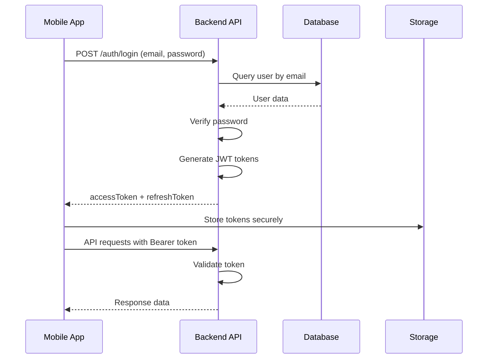
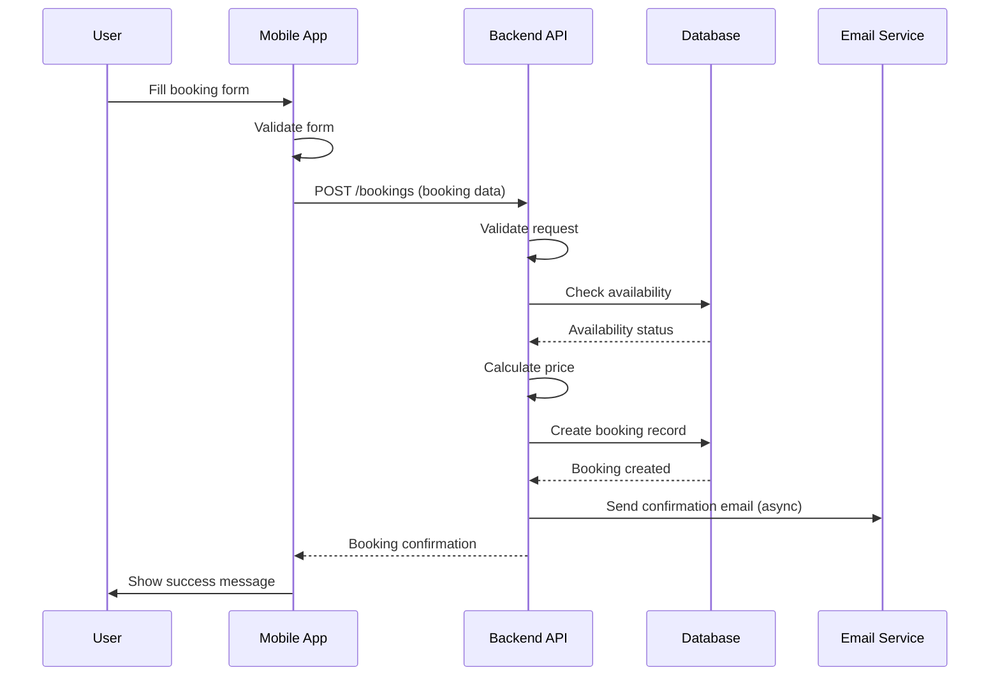
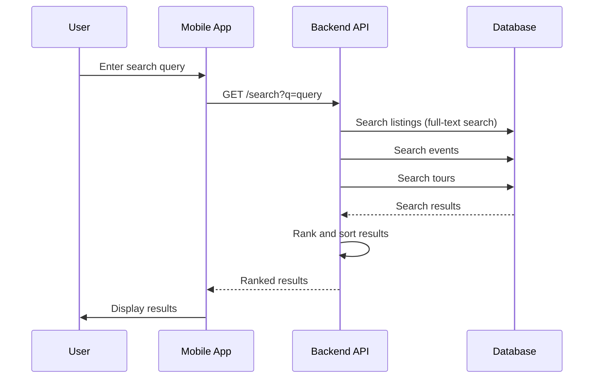
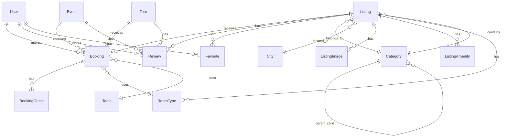

# Architecture Documentation

## System Architecture

### High-Level Overview

```
┌─────────────────┐  ┌─────────────────┐  ┌─────────────────┐  ┌─────────────────┐
│ Consumer Mobile  │  │ Merchant Mobile │  │ Admin Dashboard │  │   Web Apps      │
│    (Flutter)     │  │    (Flutter)    │  │    (Next.js)    │  │   (Next.js)     │
└────────┬─────────┘  └────────┬─────────┘  └────────┬─────────┘  └────────┬─────────┘
         │                    │                     │                      │
         │                    │                     │                      │
         └────────────────────┼────────────────────┼──────────────────────┘
                               │                    │
                               │ HTTPS/REST API     │
                               │                    │
                      ┌────────▼────────────────────▼─────────┐
                      │         Backend API                    │
                      │           (NestJS)                    │
                      └──────────────┬─────────────────────────┘
                                   │
                    ┌──────────────┼──────────────┐
                    │              │              │
         ┌──────────▼──────┐  ┌───▼────┐  ┌─────▼──────┐
         │   PostgreSQL    │  │  SINC   │  │   Email    │
         │   Database      │  │   API  │  │   Service   │
         └─────────────────┘  └─────────┘  └─────────────┘
```

---

## Application Architecture

### Mobile App Architecture (Flutter)

```
┌─────────────────────────────────────────────────────────┐
│                    Mobile App (Flutter)                 │
├─────────────────────────────────────────────────────────┤
│                                                         │
│  ┌──────────────┐  ┌──────────────┐  ┌──────────────┐ │
│  │   Features    │  │   Features   │  │   Features  │ │
│  │   (Auth)      │  │  (Explore)   │  │  (Booking)  │ │
│  └──────┬───────┘  └──────┬───────┘  └──────┬───────┘ │
│         │                  │                  │         │
│         └──────────────────┼──────────────────┘         │
│                            │                            │
│  ┌────────────────────────▼──────────────────────────┐ │
│  │              Core Layer                            │ │
│  │  ┌──────────┐  ┌──────────┐  ┌──────────┐          │ │
│  │  │Services  │  │Providers │  │ Router  │          │ │
│  │  │(API)     │  │(State)   │  │(Nav)    │          │ │
│  │  └────┬─────┘  └────┬─────┘  └────┬─────┘       │ │
│  │       │              │              │              │ │
│  │  ┌────▼──────────────────────────────▼─────┐      │ │
│  │  │         Config & Utils                   │      │ │
│  │  │  (AppConfig, Theme, Helpers)            │      │ │
│  │  └─────────────────────────────────────────┘      │ │
│  └───────────────────────────────────────────────────┘ │
│                            │                            │
│                            ▼                            │
│                    HTTP Client (Dio)                    │
│                            │                            │
└────────────────────────────┼────────────────────────────┘
                             │
                             │ HTTPS
                             ▼
                    ┌────────────────┐
                    │  Backend API   │
                    └────────────────┘
```

### Backend API Architecture (NestJS)

```
┌─────────────────────────────────────────────────────────┐
│              Backend API (NestJS)                       │
├─────────────────────────────────────────────────────────┤
│                                                         │
│  ┌──────────────────────────────────────────────────┐ │
│  │              Controllers Layer                     │ │
│  │  ┌──────────┐  ┌──────────┐  ┌──────────┐        │ │
│  │  │  Auth    │  │ Listings │  │ Bookings │        │ │
│  │  │Controller│  │Controller│  │Controller│        │ │
│  │  └────┬─────┘  └────┬─────┘  └────┬─────┘       │ │
│  └───────┼──────────────┼──────────────┼─────────────┘ │
│          │              │              │               │
│  ┌───────▼──────────────▼──────────────▼─────────────┐ │
│  │              Services Layer                         │ │
│  │  ┌──────────┐  ┌──────────┐  ┌──────────┐        │ │
│  │  │  Auth    │  │ Listings │  │ Bookings │        │ │
│  │  │ Service  │  │ Service  │  │ Service  │        │ │
│  │  └────┬─────┘  └────┬─────┘  └────┬─────┘       │ │
│  └───────┼──────────────┼──────────────┼─────────────┘ │
│          │              │              │               │
│  ┌───────▼──────────────▼──────────────▼─────────────┐ │
│  │              Data Access Layer                      │ │
│  │              (Prisma ORM)                           │ │
│  └─────────────────────────────────────────────────────┘ │
│                          │                              │
│  ┌───────────────────────▼───────────────────────────┐ │
│  │         Common/Shared Layer                         │ │
│  │  ┌──────────┐  ┌──────────┐  ┌──────────┐          │ │
│  │  │ Guards   │  │Filters   │  │Interceptors│       │ │
│  │  │(Auth)    │  │(Errors)  │  │(Logging)   │       │ │
│  │  └──────────┘  └──────────┘  └──────────┘        │ │
│  └─────────────────────────────────────────────────────┘ │
│                          │                              │
└──────────────────────────┼──────────────────────────────┘
                           │
                           ▼
                  ┌────────────────┐
                  │   PostgreSQL    │
                  │    Database     │
                  └────────────────┘
```

---

## Data Flow Architecture

### Authentication Flow



### Booking Creation Flow



### Listing Search Flow



---

## Database Architecture

### Entity Relationship Diagram



### Key Relationships

- **User** → **Booking**: One-to-many (user can have multiple bookings)
- **Listing** → **Category**: Many-to-one (listing belongs to one category)
- **Category** → **Category**: Self-referential (parent-child hierarchy)
- **Listing** → **RoomType**: One-to-many (hotel has multiple room types)
- **Booking** → **RoomType**: Many-to-one (booking uses one room type)

---

## API Architecture

### RESTful API Design

```
Base URL: https://zoea-africa.qtsoftwareltd.com/api

┌─────────────────────────────────────────────────────┐
│                  API Endpoints                      │
├─────────────────────────────────────────────────────┤
│                                                      │
│  Authentication:                                      │
│  POST   /auth/register                                │
│  POST   /auth/login                                  │
│  POST   /auth/refresh                               │
│                                                      │
│  Users:                                              │
│  GET    /users/me                                    │
│  PUT    /users/me                                    │
│  PUT    /users/me/password                          │
│                                                      │
│  Listings:                                           │
│  GET    /listings?page=1&limit=20                    │
│  GET    /listings/:id                                │
│  POST   /listings (admin)                            │
│                                                      │
│  Bookings:                                           │
│  GET    /bookings                                    │
│  POST   /bookings                                    │
│  GET    /bookings/:id                                │
│  POST   /bookings/:id/cancel                         │
│                                                      │
│  Reviews:                                            │
│  GET    /reviews?listingId=:id                      │
│  POST   /reviews                                     │
│  PUT    /reviews/:id                                 │
│                                                      │
│  Favorites:                                          │
│  GET    /favorites                                   │
│  POST   /favorites                                   │
│  DELETE /favorites?listingId=:id                     │
│                                                      │
└─────────────────────────────────────────────────────┘
```

### Request/Response Flow

```
Client Request
    │
    ├─► Authentication Middleware
    │   └─► Validate JWT Token
    │
    ├─► Validation Pipe
    │   └─► Validate Request Body/Query
    │
    ├─► Controller
    │   └─► Route to Service
    │
    ├─► Service
    │   └─► Business Logic
    │
    ├─► Prisma ORM
    │   └─► Database Query
    │
    └─► Response
        └─► JSON Response to Client
```

---

## Security Architecture

### Authentication & Authorization

```
┌─────────────────────────────────────────────────────┐
│              Security Layers                        │
├─────────────────────────────────────────────────────┤
│                                                      │
│  1. Transport Security                               │
│     └─► HTTPS/TLS Encryption                        │
│                                                      │
│  2. Authentication                                  │
│     └─► JWT Tokens (Access + Refresh)               │
│         ├─► Access Token (short-lived)              │
│         └─► Refresh Token (long-lived)              │
│                                                      │
│  3. Authorization                                   │
│     └─► Role-Based Access Control (RBAC)            │
│         ├─► User                                    │
│         ├─► Merchant                                │
│         └─► Admin                                   │
│                                                      │
│  4. Input Validation                                │
│     └─► class-validator (NestJS)                   │
│         └─► DTO Validation                          │
│                                                      │
│  5. Data Protection                                 │
│     └─► Password Hashing (bcrypt)                   │
│     └─► SQL Injection Prevention (Prisma)            │
│     └─► XSS Prevention                              │
│                                                      │
└─────────────────────────────────────────────────────┘
```

### Token Flow

```
Login
  │
  ├─► Backend validates credentials
  │
  ├─► Generate JWT tokens
  │   ├─► Access Token (15min expiry)
  │   └─► Refresh Token (7days expiry)
  │
  └─► Return tokens to client
      │
      └─► Client stores tokens securely
          │
          ├─► Access Token → Memory/Encrypted Storage
          └─► Refresh Token → Secure Storage
              │
              └─► Auto-refresh on 401
                  │
                  └─► POST /auth/refresh
                      │
                      └─► New Access Token
```

---

## Deployment Architecture

### Production Deployment

```
┌─────────────────────────────────────────────────────┐
│              Production Environment                 │
├─────────────────────────────────────────────────────┤
│                                                      │
│  ┌──────────────┐      ┌──────────────┐           │
│  │   Primary     │      │    Backup    │           │
│  │    Server     │      │    Server    │           │
│  │               │      │              │           │
│  │  ┌─────────┐  │      │  ┌─────────┐ │           │
│  │  │ Backend │  │      │  │ Backend │ │           │
│  │  │  API    │  │      │  │  API    │ │           │
│  │  │(Docker) │  │      │  │(Docker) │ │           │
│  │  └────┬────┘  │      │  └────┬────┘ │           │
│  └───────┼───────┘      └───────┼───────┘           │
│          │                      │                    │
│          └──────────┬───────────┘                    │
│                     │                                │
│          ┌──────────▼───────────┐                    │
│          │   PostgreSQL DB      │                    │
│          │   (Remote Server)    │                    │
│          └─────────────────────┘                    │
│                                                      │
│  ┌──────────────────────────────────────┐           │
│  │        Mobile Apps                   │           │
│  │  ┌──────────┐      ┌──────────┐     │           │
│  │  │   iOS    │      │ Android  │     │           │
│  │  │   App    │      │   App    │     │           │
│  │  └──────────┘      └──────────┘     │           │
│  └──────────────────────────────────────┘           │
│                                                      │
└─────────────────────────────────────────────────────┘
```

### Deployment Flow

```
Developer
    │
    ├─► Git Push
    │
    ├─► CI/CD Pipeline (Future)
    │   └─► Run Tests
    │   └─► Build
    │
    ├─► Deployment Script
    │   └─► sync-all-environments.sh
    │       ├─► Sync to Primary Server
    │       └─► Sync to Backup Server
    │
    ├─► Server
    │   └─► Docker Compose
    │       ├─► Build Image
    │       └─► Restart Container
    │
    └─► Health Check
        └─► Verify Deployment
```

---

## Technology Stack

### Frontend (Mobile)
- **Framework**: Flutter
- **Language**: Dart
- **State Management**: Riverpod
- **Navigation**: GoRouter
- **HTTP Client**: Dio
- **Storage**: SharedPreferences, Hive

### Backend
- **Framework**: NestJS
- **Language**: TypeScript
- **Database**: PostgreSQL + PostGIS
- **ORM**: Prisma
- **Authentication**: JWT
- **Validation**: class-validator
- **Documentation**: Swagger/OpenAPI

### Admin Dashboard
- **Framework**: Next.js
- **Language**: TypeScript
- **UI Library**: React
- **Styling**: Tailwind CSS
- **Charts**: ApexCharts

---

## Scalability Considerations

### Horizontal Scaling

```
Load Balancer
    │
    ├─► Backend Instance 1
    ├─► Backend Instance 2
    └─► Backend Instance N
         │
         └─► Shared Database (PostgreSQL)
```

### Caching Strategy

- **API Response Caching**: Redis (future)
- **Image CDN**: Cloud storage (future)
- **Mobile Caching**: Local storage + API cache

### Database Optimization

- **Indexes**: On frequently queried fields
- **Connection Pooling**: Prisma connection pool
- **Query Optimization**: Efficient Prisma queries
- **Read Replicas**: For read-heavy operations (future)

---

## Monitoring & Observability

### Logging

- **Backend**: Winston/Pino (structured logging)
- **Mobile**: Debug logs in development
- **Error Tracking**: Sentry (future)

### Metrics

- **API Response Times**: Monitor endpoint performance
- **Database Query Times**: Monitor slow queries
- **Error Rates**: Track error frequency
- **User Activity**: Track user engagement (future)

---

## Future Architecture Enhancements

1. **Microservices**: Split into smaller services (if needed)
2. **Message Queue**: For async processing (RabbitMQ/Kafka)
3. **Caching Layer**: Redis for API caching
4. **CDN**: For static assets and images
5. **Search Engine**: Elasticsearch for advanced search
6. **Real-time**: WebSocket for real-time features
7. **Analytics**: Dedicated analytics service

