# Architecture Diagrams

This document contains visual architecture diagrams using Mermaid syntax. These diagrams can be rendered in:
- GitHub (native support)
- VS Code (with Mermaid extension)
- Online tools (mermaid.live)

---

## System Overview

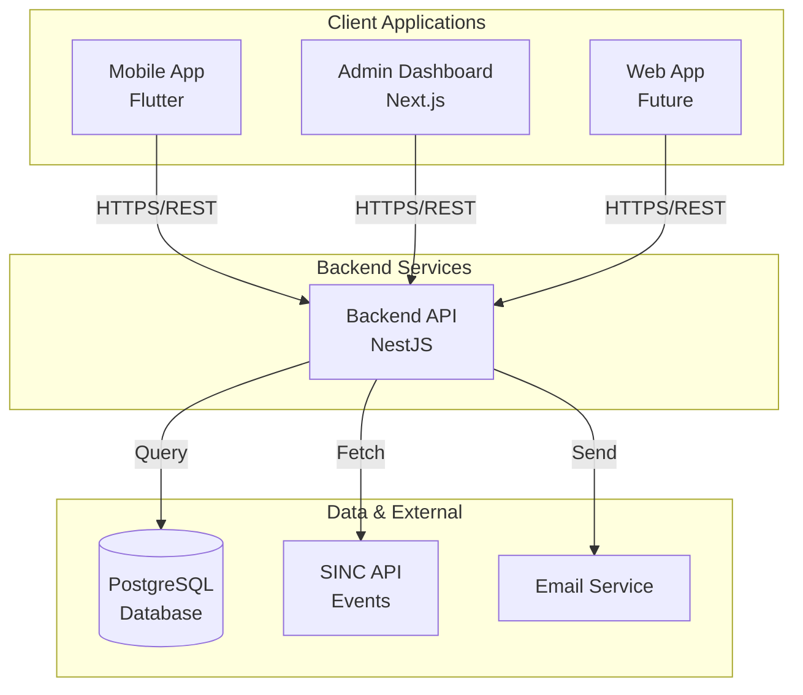

---

## Mobile App Architecture

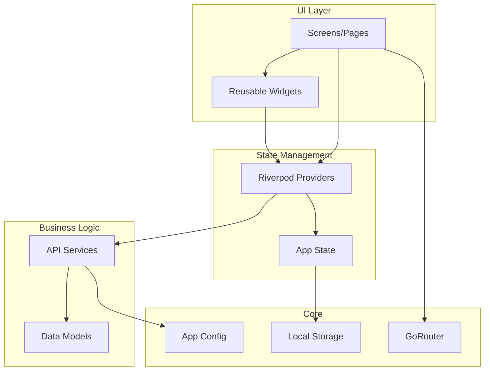

---

## Backend API Architecture

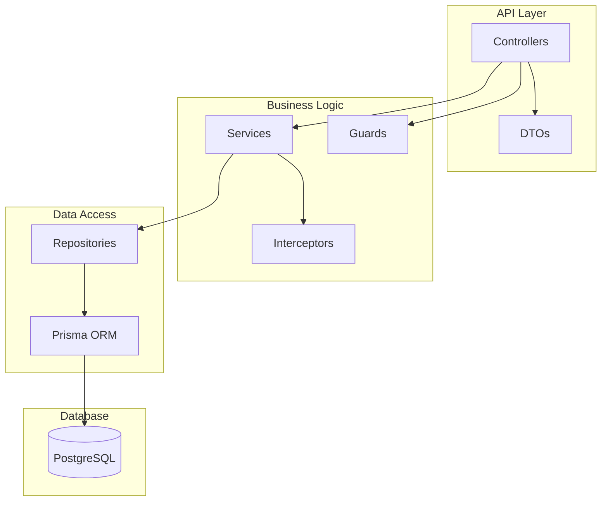

---

## Authentication Flow

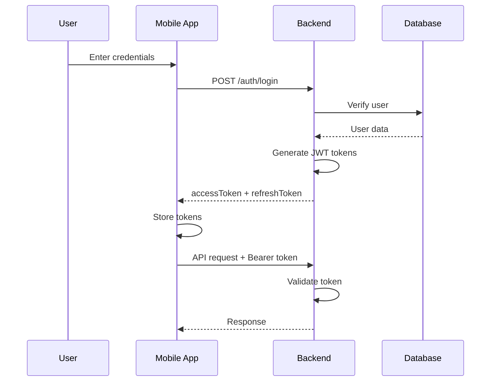

---

## Booking Flow

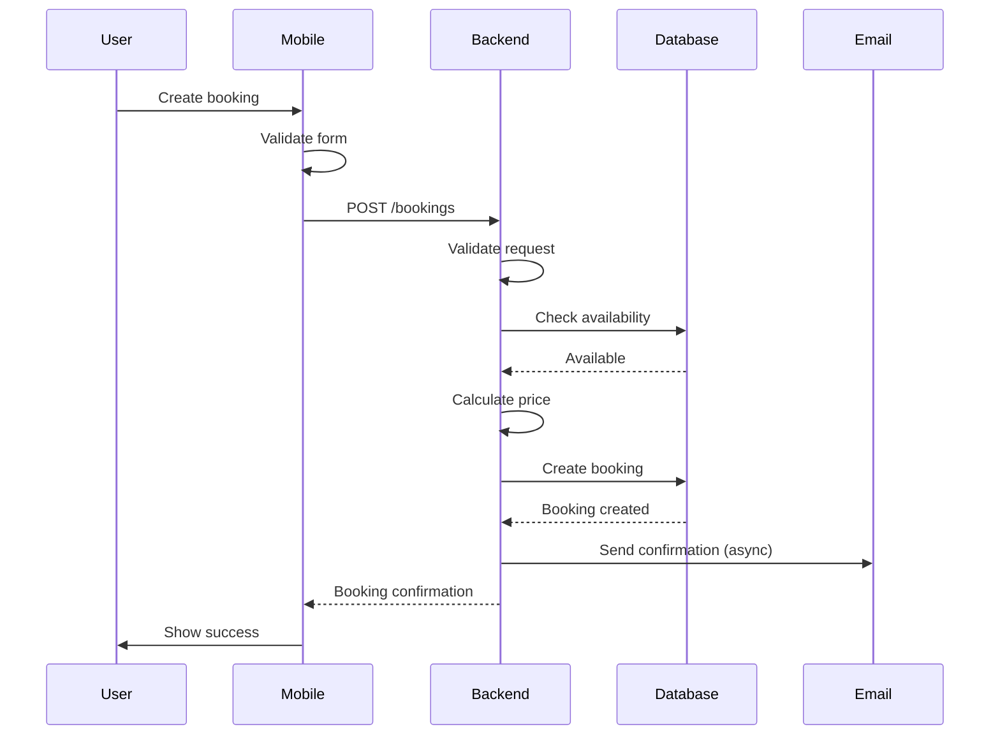

---

## Database Schema

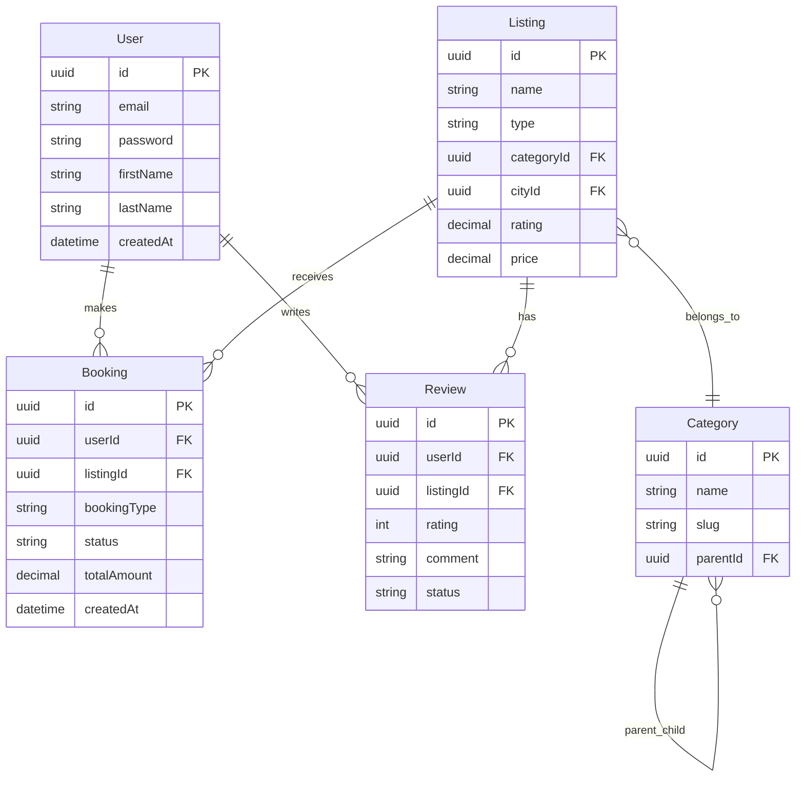

---

## API Request Flow

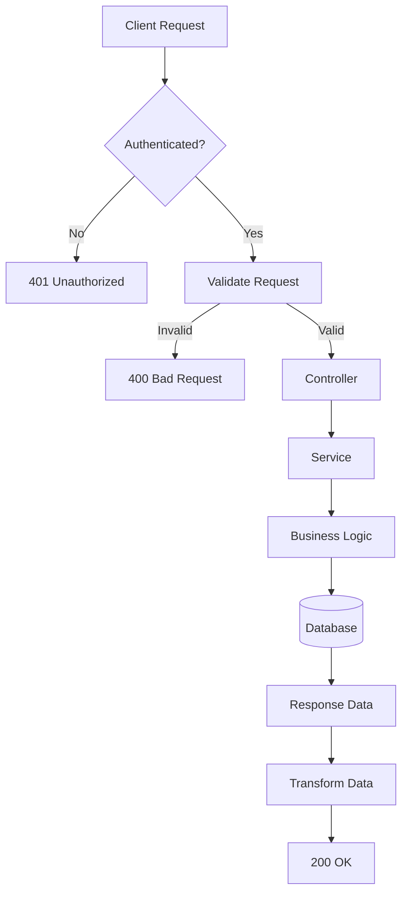

---

## Deployment Architecture

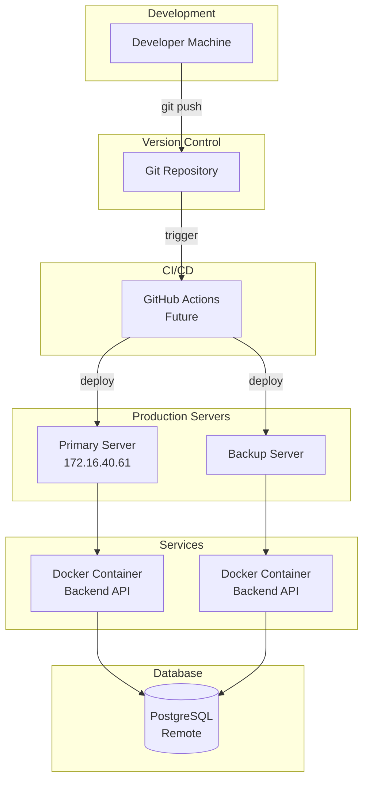

---

## Security Architecture

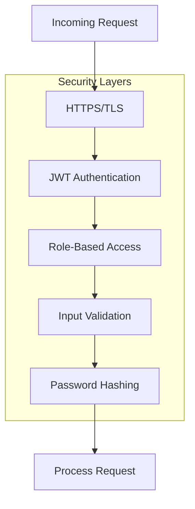

---

## Data Flow - Listing Search

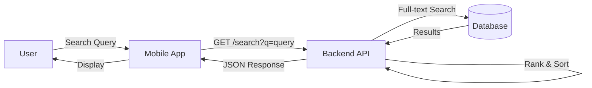

---

## Component Interaction - Booking

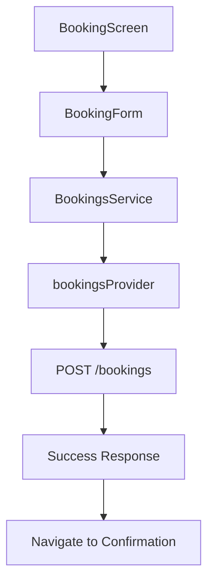

---

## Module Dependencies

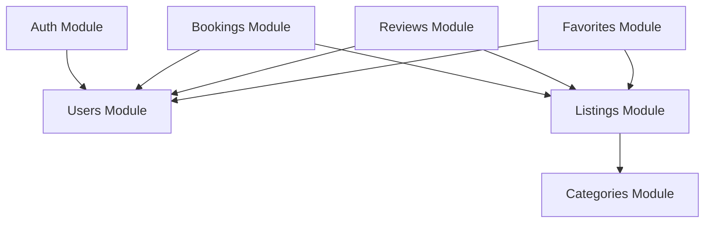

---

## Error Handling Flow

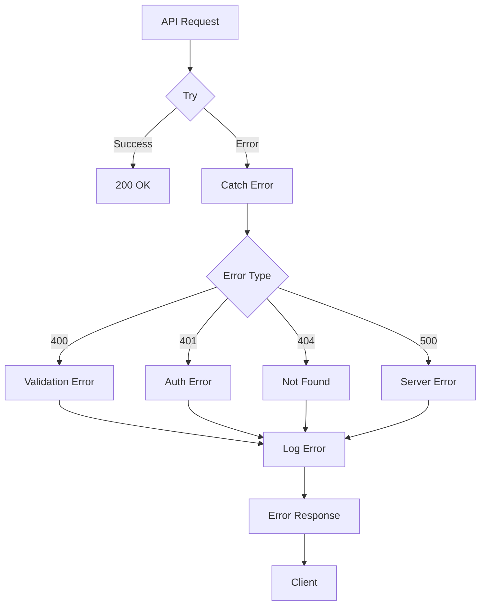

---

## Token Refresh Flow

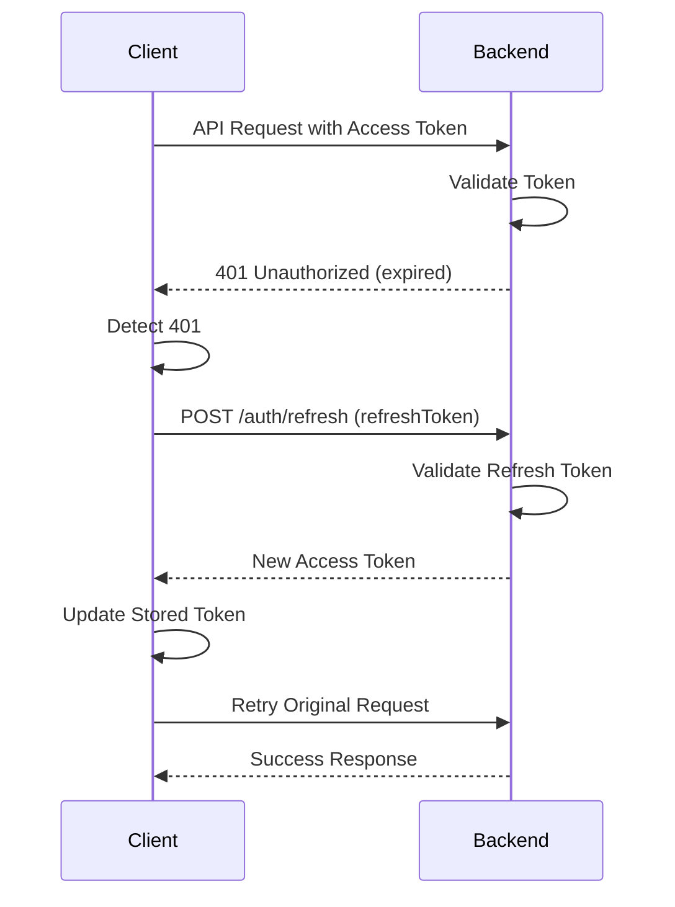

---

## Database Query Flow

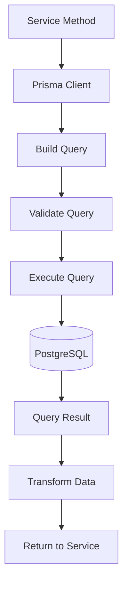

---

## Mobile State Management Flow

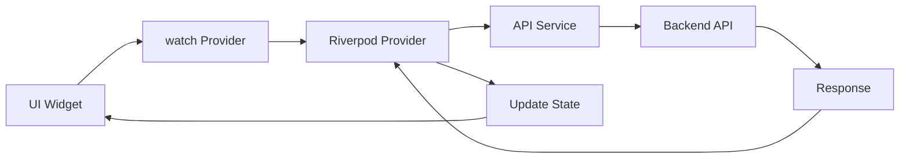

---

## Admin Dashboard Architecture

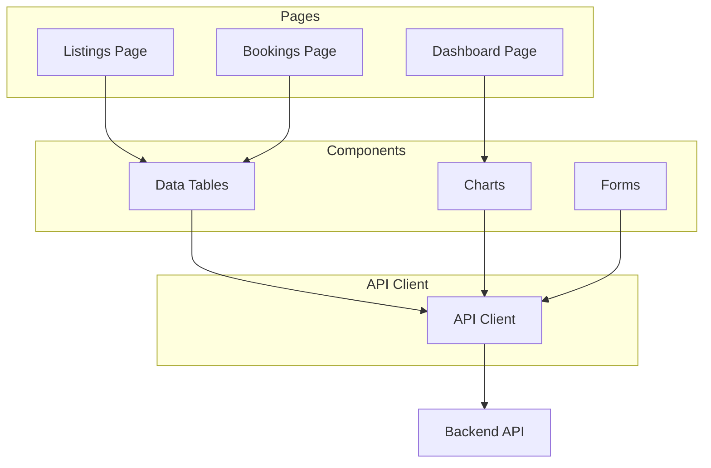

---

## How to View These Diagrams

### GitHub
These diagrams render automatically in GitHub markdown files.

### VS Code
Install the "Markdown Preview Mermaid Support" extension.

### Online
Copy the diagram code to [mermaid.live](https://mermaid.live) to view and export.

### Documentation Tools
- GitBook
- Notion
- Confluence (with Mermaid plugin)

